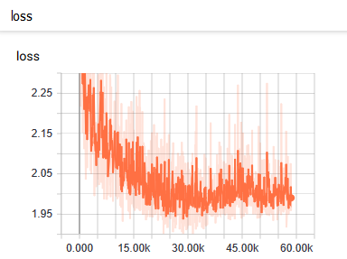
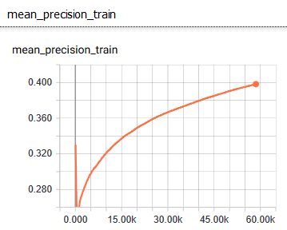

# Temporal Action Localization

In this project we implement a deep learning architecture that is compose for two parts. The first one is a feature extractor made by a group of convolutional and fully connected layers, the second one is a bi-directional LSTM layer. We bades on the architecture proposed in [_Action Recognition in Video Sequences using Deep Bi-Directional LSTM With CNN Features_](https://ieeexplore.ieee.org/abstract/document/8121994) by Ullah A, et al.

To save the convolution process proposed in the architecture we use a pre trained network to extract the feature maps of each frame for every video in the data set. The model that we use is **InceptionResNetV2** whit the weights of **Imagenet**.

Our objective with this project is to predict what kind of actions occurs in a specific temporal regions on a video.

### Team members

* Juan Camilo Fernandez
* Juan David Gil
* Juan Sebastián Peláez


### Project structure

- notebooks/
	ScriptImageExtraction
	ScriptTestInputFn
	ScriptVideoDownload
	ScriptVideoPreProcessing
	ScriptVideoProcessing
- tests/
	Pretrain Network
	Prediction
	input
- config.yml
- data.py
- download_video_script.py
- feature_map_extractor.py
- metrics.py
- model.py
- predictions_json.py
- trainer.py
- utils.py
- video_input.py


### How to execute the project with FloydHub

1. For data preprocessing

```
floyd run --cpu --env tensorflow-1.12 --data arista/datasets/activitynet-videos/1:dataset 'python feature_map_extractor.py'


floyd run --cpu --env tensorflow-1.12 --data arista/datasets/activitynet-videos/1:dataset 'python feature_map_extractor.py validation'
```

2. For train the model

```
floyd run --gpu --env tensorflow-1.12 --data arista/datasets/featuremaps-jsc/1:datasets "python trainer.py"
```

## Model results

### Hyperparameters

* **Shuffle**: True
* **Skip frames**: 6
* **Max Frames**: 15
* **Taxonomy Level**: 3
* **Learning Rate**: 0.0001
* **Max Steps**: 100000
* **Batch Size**: 15
* **Epochs**: 3000
* **Cell type**: LSTM

### Training

#### Loss



#### Mean precision train



### Metrics

#### Training

* **global_step**: 58620
* **loss**: 1.991
* **mean_precision_train**: 0.3982